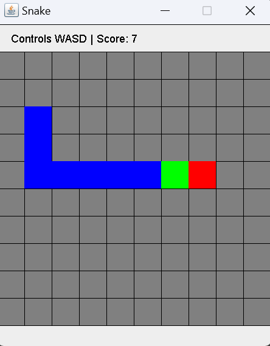
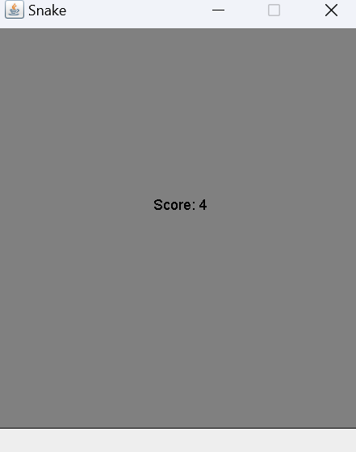

SNAKE GAME IN JAVA by Neel Patel

After running the file SnakeRunner.Java the code will open a window of a functional snake GAME

It works like this:

A snake who you control using WASD will move along a 10 by 10 grid

If it's head (indicated in green) navigates to a tile with an apple in it (indicated in red) the snake will grow

The snakes head will be highlighed in red while the rest of the body will be in blue

A score is shown to the player on the top of the window, and in the middle once the game is over. 

